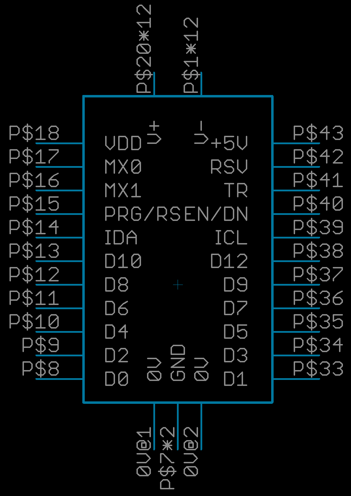

# Tiles

Files and descriptions to detail 'Tile' add ons

Tiles are a modular board add-ons that offer good mechanical construction and optional high power which is great for projects in automation or robotics for instance. The tile format is also great when you are building deck like projects consisting of up to 3 PCB layers.

This is very much WIP, I will add more documentation soon, to learn about what tiles are you could skim through some of my older [stream recordings](https://www.youtube.com/channel/UCQSPg8L4WFBGuj_MnvQQ7Qw/videos)

[Discuss Tiles on Discord](https://discord.gg/RCGcgbQNZK)

## Each Tile Features:
* 12 General purpose digiatl IO
* 2 mixed signal IO
* 1 I2C interface
* 1 Dedicated Tile Request signal
* 2 shared Control signals reset and enable
* IO Logic power and +5v along with high power  +/-V

